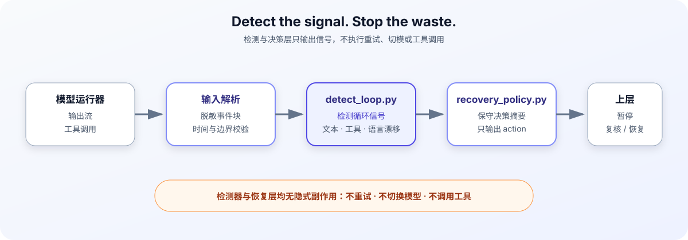

# LLM Degenerate Loop Guardrails

[](https://github.com/xli498/mimo-stable/actions/workflows/quality.yml)
[](https://github.com/xli498/mimo-stable/releases)
[](LICENSE)
[](pyproject.toml)

[中文说明](README.md)

See the [public specification](docs/public-spec.md) and [implementation roadmap](docs/roadmap.md) for the supported contract and scope.

A zero-runtime-dependency toolkit for detecting degenerate loops in LLM output
and tool calls, producing conservative engineering decisions, and preserving
reproducible evidence.

The package also exposes a small `inspect_events` API for framework-neutral
integration. It normalizes text and tool-call events, returns detector evidence
and a policy suggestion, and performs no retries or other side effects.

> [!IMPORTANT]
> This project detects loop signals and emits recovery decisions. It does not
> claim to repair a model or execute retries, model switches, tool calls, or
> process control. The upper-layer runner owns those side effects.

## 30-second start



Run the included synthetic fixture:

```bash
python3 scripts/detect_loop.py \
  --json \
  --timeout 60 \
  --log fixtures/loop_detected.log
```

The command exits with status `1` when a loop signal is detected. A typical
summary looks like this:

```json
{
  "loop_detected": true,
  "details": {
    "type": "consecutive_identical_output"
  }
}
```

| Exit code | Meaning |
| :---: | :--- |
| `0` | No loop detected |
| `1` | Loop detected |
| `2` | Invalid input or arguments |

## What it detects

The detector is designed for observable signals such as:

- consecutive identical or near-identical output blocks;
- repeated tool calls, including normalized JSON key order;
- repeated calls only when their output blocks are consecutive;
- language drift and related output anomalies when evidence supports them.

Detection results are signals, not model-level explanations. MiMo is the initial
case study; observations from MiMo, GLM, and other models must be recorded
independently and must not be treated as universal conclusions.

## Recovery decisions

Pipe a detector summary into the conservative policy layer:

```bash
python3 scripts/detect_loop.py \
  --json \
  --timeout 60 \
  --log fixtures/loop_detected.log \
  > /tmp/loop-summary.json

python3 scripts/recovery_policy.py \
  --summary /tmp/loop-summary.json \
  --retryable \
  --retry-count 0
```

The policy emits a decision only. The upper-layer runner decides whether to
pause, retry, switch models, or request human review under its own safety and
idempotency rules.

## Installation

The project has no runtime dependencies and currently supports source execution
and local CLI installation.

### Run from source

```bash
git clone https://github.com/xli498/mimo-stable.git
cd mimo-stable
python3 scripts/detect_loop.py --log fixtures/loop_detected.log
```

### Install the CLI from PyPI

```bash
python3 -m pip install mimo-stable
mimo-loop-detect --json --timeout 60 --log fixtures/loop_detected.log
```

> [!NOTE]
> `mimo-stable` provides the `mimo-loop-detect` command-line tool and the
> framework-neutral `inspect_events` Python API.

## Examples

- [Basic text detection](examples/basic-text-detection.md)
- [Tool-call detection](examples/tool-call-detection.md)
- [Recovery policy integration](examples/recovery-policy-integration.md)

Each example shows inputs, signals, or decisions only. Actual stopping,
retrying, model switching, tool execution, and human review remain the
responsibility of the upper-layer runner.

## Repository layout

```text
scripts/detect_loop.py       # Signal detection
scripts/recovery_policy.py   # Conservative decision output
fixtures/                    # Synthetic regression fixtures
examples/                    # Minimal integration examples
references/                  # Evidence and parameter notes
tests/                       # Behavioral tests
```

## Testing

```bash
python3 scripts/check_version.py
python3 tests/test_detector.py
python3 scripts/benchmark_fixtures.py
bash scripts/test_short.sh
bash scripts/test_long.sh
```

CI tests Python 3.10, 3.11, and 3.12.

## Evidence and boundaries

- Fixtures are synthetic or fully redacted.
- Do not commit API keys, tokens, private prompts, user data, private endpoints,
  or raw production payloads.
- Historical model parameters are case-study evidence, not cross-model defaults.
- The detector and policy layer have no implicit side effects.

## License

MIT. See [LICENSE](LICENSE).
